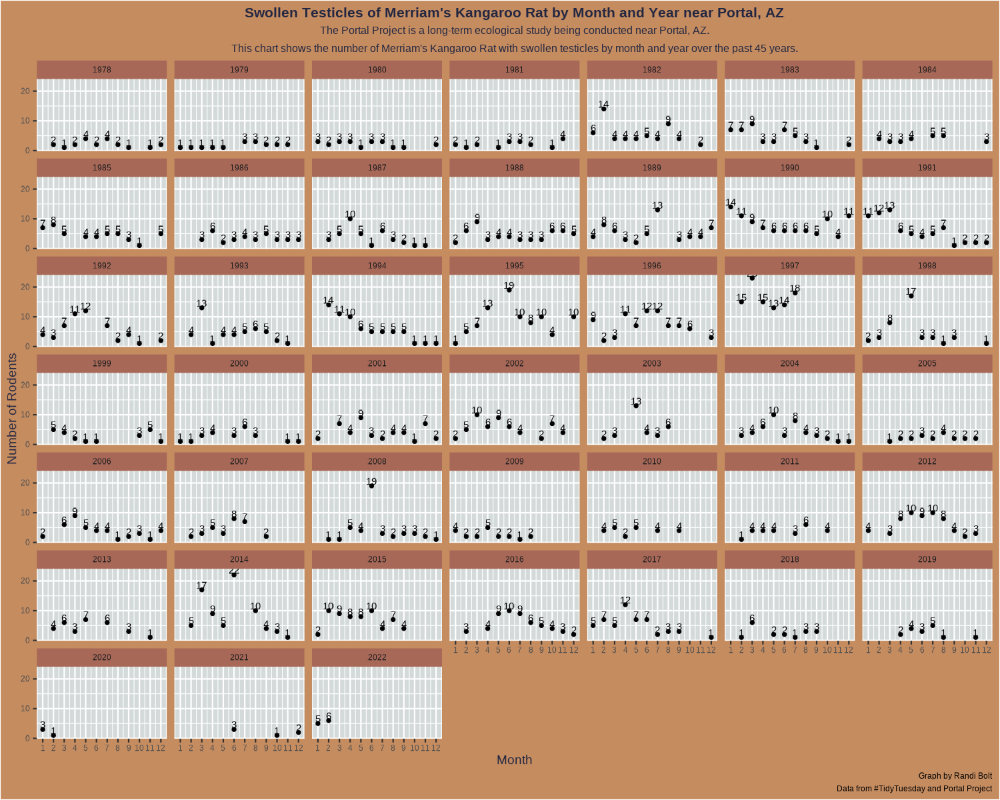

# Portal Project 

> The Portal Project is a long-term ecological study being conducted near Portal, AZ. Since 1977, the site has been used to study the interactions among rodents, ants and plants and their respective responses to climate. To study the interactions among organisms, they experimentally manipulate access to 24 study plots. This study has produced over 100 scientific papers and is one of the longest running ecological studies in the U.S.

Week 18 Goal: Add color and values above points. 