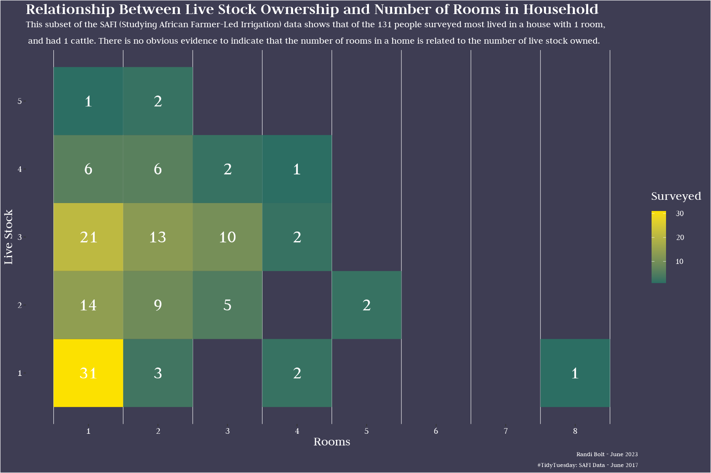

# SAFI Data 

The data this week comes from the [SAFI (Studying African Farmer-Led Irrigation) survey](https://datacarpentry.org/socialsci-workshop/data/), a subset of the data used in the [Data Carpentry Social Sciences workshop](https://datacarpentry.org/socialsci-workshop/). So, if you're looking how to learn how to work with this data, lessons are already available! Data is available through [Figshare](https://figshare.com/articles/dataset/SAFI_Survey_Results/6262019).

CITATION: Woodhouse, Philip; Veldwisch, Gert Jan; Brockington, Daniel; Komakech, Hans C.; Manjichi, Angela; Venot, Jean-Philippe (2018): SAFI Survey Results. doi:10.6084/m9.figshare.6262019.v1

> SAFI (Studying African Farmer-Led Irrigation) is a currently running project which is looking at farming and irrigation methods. This is survey data relating to households and agriculture in Tanzania and Mozambique. The survey data was collected through interviews conducted between November 2016 and June 2017 using forms downloaded to Android Smartphones. The survey forms were created using the ODK (Open Data Kit) software via an Excel spreadsheet. The collected data is then sent back to a central server. The server can be used to download the collected data in both JSON and CSV formats. This is a teaching version of the collected data that we will be using. It is not the full dataset.

> The survey covered such things as; household features (e.g. construction materials used, number of household members), agricultural practices (e.g. water usage), assets (e.g. number and types of livestock) and details about the household members.

> The basic teaching dataset used in these lessons is a subset of the JSON dataset that has been converted into CSV format.

Week 24 Goal: Make a heatmap graph. 