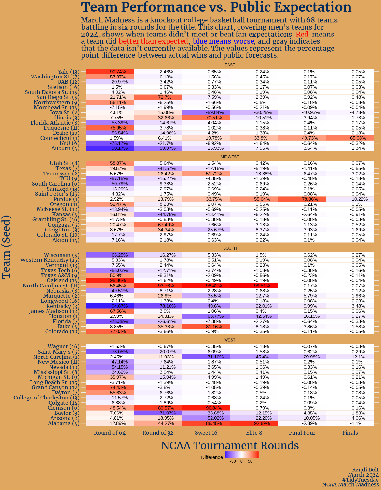

# NCAA Men's March Madness

This week’s data is [NCAA Men’s March Madness data](https://www.kaggle.com/datasets/nishaanamin/march-madness-data) from Nishaan Amin’s Kaggle dataset and analysis [Bracketology: predicting March Madness](https://www.kaggle.com/code/nishaanamin/bracketology-predicting-march-madness).

[Blog Post - Week 13 Tidy Tuesday: NCAA Men's March Madness](https://www.rbolt.me/blog/technical-blog/posts/2024_03_26-tidytuesday-marchmadness/)