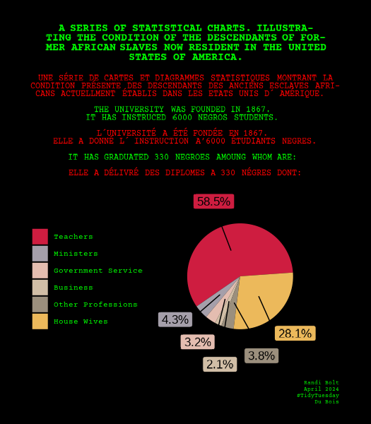

# Du Bois Visualization Challenge

For this week’s TidyTuesday, I’ve recreated W.E.B. Du Bois’s ‘A Series of Statistical Charts, Illustrating the Conditions of Descendants of Former African Slaves Now Resident in the United States of America,’ utilizing R and the Tidyverse for a modern analysis.

[Blog Post - Week 14 Tidy Tuesday: Du Bois Visualization Challenge](https://www.rbolt.me/blog/technical-blog/posts/2024_04_02_tidytuesday-dubois/)