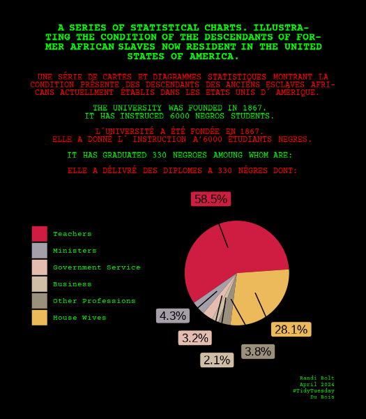
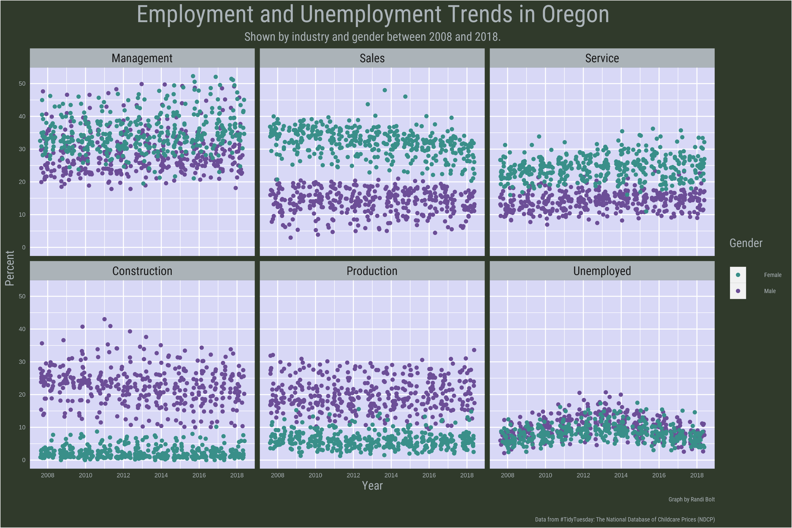

<h1 align="center">
TidyTuesday
</h1>

&nbsp;&nbsp;&nbsp; [Website][Website]&nbsp;&nbsp;&nbsp;|&nbsp;&nbsp;&nbsp; [Email][Email]&nbsp;&nbsp;&nbsp;|&nbsp;&nbsp;&nbsp; [LinkedIn][LinkedIn]

<!--
Quick Link
-->

[Website]:https://www.rbolt.me/
[Email]:randibolt93@gmail.com 
[LinkedIn]:https://www.linkedin.com/in/randi-bolt/

This repository contains my submissions for the weekly data visualization challenge [TidyTuesday](https://github.com/rfordatascience/tidytuesday).

TidyTuesday is a weekly data analysis and visualization challenge that provides a structured format to practice data wrangling and visualization skills using R programming language. Each week, a new dataset is posted to the [TidyTuesday Github repository](https://github.com/rfordatascience/tidytuesday) and participants are encouraged to explore and visualize the data using the principles of tidy data.

Submissions (click to expand)
 

<!-- toc -->
* **2024**
  - 2024/Week 27 [TidyTuesday Datasets](https://github.com/rbolt13/tidytuesday/tree/main/2024/week_27)
  - 2024/Week 14 [Du Bois Visualization Challenge](https://github.com/rbolt13/tidytuesday/tree/main/2024/week_14)
  - 2024/Week 13 [NCAA Men's March Madness](https://github.com/rbolt13/tidytuesday/tree/main/2024/week_13)
* **2023**
  - 2023/Week 25 [UFO Sightings Redux](https://github.com/rbolt13/tidytuesday/tree/main/2023/week_25)
  - 2023/Week 24 [SAFI Data](https://github.com/rbolt13/tidytuesday/tree/main/2023/week_24)
  - 2023/Week 22 [Verified Oldest People](https://github.com/rbolt13/tidytuesday/tree/main/2023/week_22)
  - 2023/Week 21 [Squirrel Census](https://github.com/rbolt13/tidytuesday/tree/main/2023/week_21)
  - 2023/Week 20 [Tornado Data](https://github.com/rbolt13/tidytuesday/tree/main/2023/week_20)
  - 2023/Week 19 [Childcare Costs](https://github.com/rbolt13/tidytuesday/tree/main/2023/week_19)
  - 2023/Week 18 [Portal Project](https://github.com/rbolt13/tidytuesday/tree/main/2023/week_18)
  - 2023/Week 17 [London Marathon](https://github.com/rbolt13/tidytuesday/tree/main/2023/week_17)
  - 2023/Week 8 [Bob Ross](https://github.com/rbolt13/tidytuesday/tree/main/2023/week_08)
  
<!-- tocstop -->

<h2 align="center">
About this Repository
</h2>

In this repository, you'll find my submissions for each week's challenge. Each submission is organized into its own folder named after the week of the submission within each year folder. Within each week folder, you'll find the following files:

* `README.md`: A brief summary of the challenge.
* `index.R`: The script used to generate the visual.
* `functions`: The functions used to clean, visualize, and style the visual. 
* `img.png`: The resulting visual.

<h2 align="center">
2024 Submissions
</h2>

### Week 27 - TidyTuesday Data

### Week 14 - Du Bois Visualization Challenge 2024

### Week 13 - NCAA Men's March Madness

<h2 align="center">
2023 Submissions
</h2>

### Week 25 - UFO Sightings Redux

### Week 24 - SAFI Data

### Week 22 - Verified Oldest People

### Week 21 - Squirrel Census

### Week 20 - Tornado Data

### Week 19 - Childcare Costs

### Week 18 - Portal Project

### Week 17 - London Marathon

### Week 8 - Bob Ross

